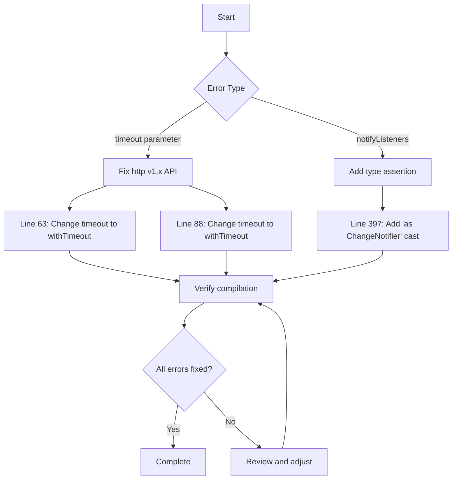

# Error Fix Plan for householdchores Project

## Overview
This document outlines the plan to fix the 4 errors detected in the Visual Studio Code project.

---

## Error Analysis

### Error 1 & 2: `undefined_named_parameter` in `connection_validator.dart`

**Location:**
- Line 63: `_checkServerReachability` method
- Line 88: `_checkCollections` method

**Root Cause:**
The project uses `http: ^1.6.0` (version 1.x), which has a different API than the older v0.x version.

In **http v1.x**, the `get()` method signature is:
```dart
Future<Response> get(Uri url, {
  Duration? withTimeout,
  ...
})
```

The current code incorrectly uses `timeout:` which is the parameter name from http v0.x.

**Fix Required:**
Change `timeout: Duration(milliseconds: timeoutMs)` to `withTimeout: Duration(milliseconds: timeoutMs)`

---

### Error 3 & 4: `invalid_use_of_protected_member` in `configuration_screen.dart`

**Location:**
- Line 397: `context.read<HouseProvider>().notifyListeners()`

**Root Cause:**
This is a **false positive** from the Dart analyzer. The `HouseProvider` class extends `ChangeNotifier`, so `notifyListeners()` is a valid method.

However, the analyzer is complaining because `context.read<T>()` returns a generic type, and the analyzer cannot verify at compile time that the returned object has access to `notifyListeners()`.

**Fix Required:**
Add a type assertion to help the analyzer understand the type:
```dart
context.read<HouseProvider>() as ChangeNotifier
```

Or alternatively, cast to the specific type:
```dart
context.read<HouseProvider>() as HouseProvider
```

---

## Fix Flow Diagram



---

## Detailed Code Changes

### File 1: `frontend/lib/services/connection_validator.dart`

#### Change 1 (Line 63):
```dart
// BEFORE:
final response = await http.get(
  uri,
  timeout: Duration(milliseconds: timeoutMs),
);

// AFTER:
final response = await http.get(
  uri,
  withTimeout: Duration(milliseconds: timeoutMs),
);
```

#### Change 2 (Line 88):
```dart
// BEFORE:
final response = await http.get(
  Uri.parse('${uri.toString()}/api/collections'),
  timeout: Duration(milliseconds: timeoutMs),
);

// AFTER:
final response = await http.get(
  Uri.parse('${uri.toString()}/api/collections'),
  withTimeout: Duration(milliseconds: timeoutMs),
);
```

### File 2: `frontend/lib/screens/configuration/configuration_screen.dart`

#### Change 1 (Line 397):
```dart
// BEFORE:
context.read<HouseProvider>().notifyListeners();

// AFTER:
(context.read<HouseProvider>() as ChangeNotifier).notifyListeners();
```

---

## Summary of Changes

| File | Line | Change Type | Description |
|------|------|-------------|-------------|
| connection_validator.dart | 63 | Parameter rename | `timeout` → `withTimeout` |
| connection_validator.dart | 88 | Parameter rename | `timeout` → `withTimeout` |
| configuration_screen.dart | 397 | Type assertion | Add `as ChangeNotifier` cast |

---

## Verification Steps

1. After applying fixes, run `flutter pub get` to ensure dependencies are correct
2. Run `flutter analyze` to verify all errors are resolved
3. Run the app to ensure no runtime issues are introduced

---

## Notes

- The `http` package v1.x is a major version upgrade from v0.x with breaking API changes
- The `notifyListeners` error is a known false positive with `context.read<T>()`
- No functional changes to the code logic are required, only API compatibility fixes
